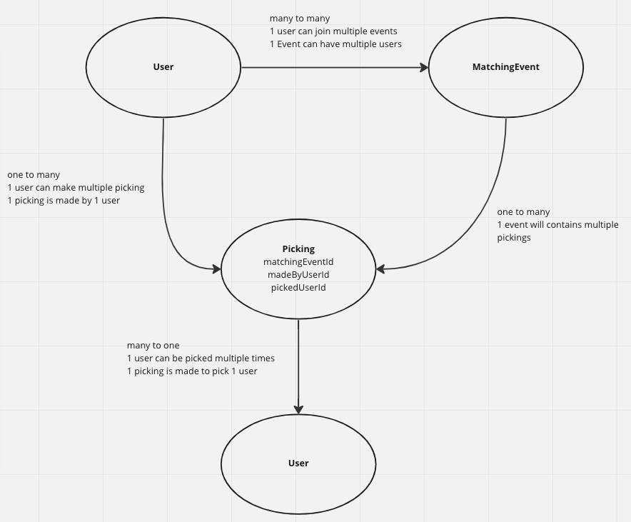
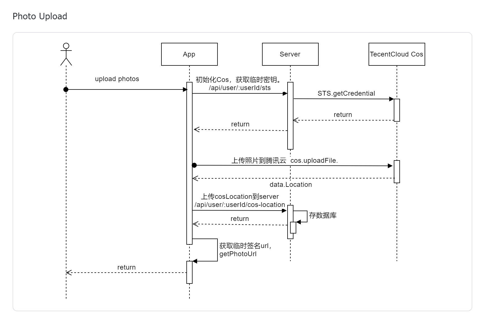

### Development

Start the project:

```
# build the server image
npm run docker-build

# start server
npm run docker-run

# initilize DB
server/dev/reload-db

# print logs
docker logs -f api

# start client
cd ./client && npm run start

```

DB migration:

```
# generate migration file
# 当对model进行了修改，需要跑以下命令让typeorm根据model的改动生成新的db migration文件
# 如首次跑项目，跳过此步，直接执行下一步
docker exec api npm run typeorm -- migration:generate ./server/src/migrations/sync -d ./server/src/data-source.ts -p

# run migrations
# migration文件生成后，需要跑以下命令，typeorm会自动把未执行过的migration都执行
docker exec api npx typeorm-ts-node-commonjs migration:run -d ./server/src/data-source.ts
```

Go into api docker container for debugging

```
docker compose -f docker-compose.dev.yml exec api bash
```

### Urls

#### Local

[postgres adminer](http://localhost:8080/?pgsql=db&username=postgres&db=matching_app&ns=public)

[api](http://localhost:4000)

[frontend](http://localhost:3000/matching-event/36cffe10-3f93-40f3-96be-26cb42399955)

### VS Code extensions

Install VS Code extension:

1. ESLint - to show lint messages on the fly
2. Prettier - to format code on save

```json
// .vscode/settings.json
{
  "editor.defaultFormatter": "esbenp.prettier-vscode",
  "editor.formatOnSave": true,
  "editor.codeActionsOnSave": {
    "source.fixAll": true
  }
}
```

### Modeling



### Photo uploading


